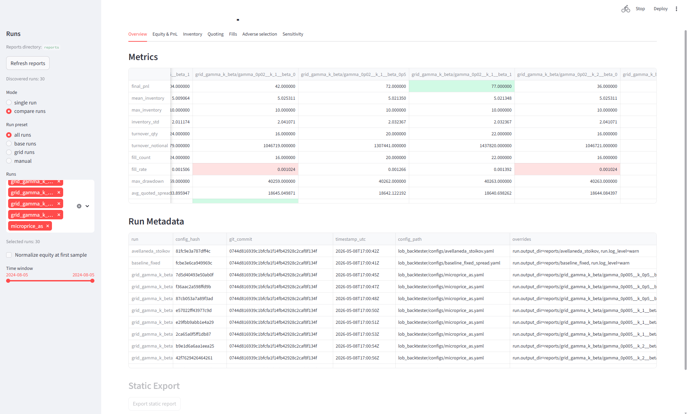
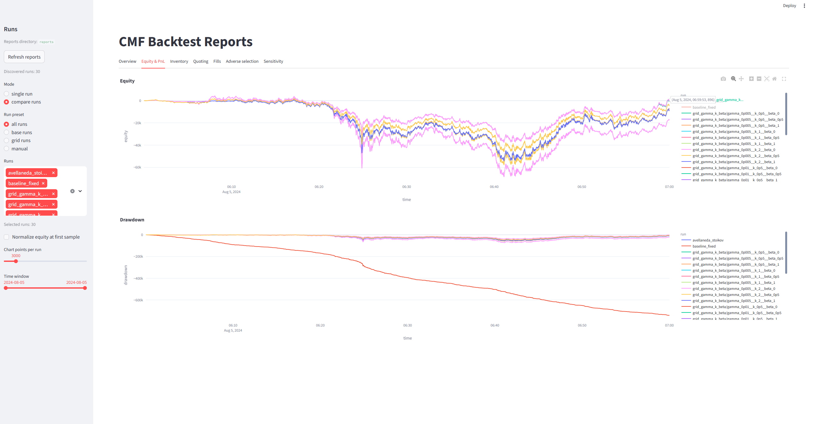

# CMF LOB Backtester

Event-driven C++20 backtest engine for historical limit-order-book replay and
market-making strategies. The target scope is a reproducible CMF HFT submission
with data audit, a limit-order-book simulator, Avellaneda-Stoikov strategies,
metrics, reports, and documentation.

## Current Status

Implemented:

- CMake bootstrap for `lob_core`, `lob_backtest`, and `lob_tests`.
- YAML config loader.
- Streaming CSV DataLoader for `lob.csv`, `trades.csv`, and optional
  `depth_updates.csv`.
- Normalized `MarketEvent` stream ordered by `(ts_ns, seq)`.
- Market-By-Price `OrderBook` with snapshot/update replay and crossed-book
  recovery policies.
- Order-book feature functions for mid, spread, imbalance, weighted mid,
  microprice proxy, and rolling mid-return volatility.
- OrderManager lifecycle for limit order submit/cancel/replace/fill, risk gates,
  and `orders.csv` logging.
- FillModel for trade-price, best-quote, and mid-price execution checks with
  maker/taker fee accounting.
- Portfolio accounting for cash, signed inventory, realized/unrealized PnL, and
  mark-to-market equity.
- MetricsEngine for PnL, inventory, turnover, fill-rate, drawdown,
  market-making metrics, and `metrics.json`/CSV outputs.
- BacktestEngine event loop integrating DataLoader, OrderBook, features,
  strategy callbacks, OMS, FillModel, Portfolio, MetricsEngine, and run
  artifacts including `orders.csv` and `fills.csv`.
- Fixed-spread baseline strategy with YAML config, inventory guard, maker-only
  risk validation, synthetic PnL test, and sample artifact smoke coverage.
- Avellaneda-Stoikov strategy with formula tests, rolling mid-return
  volatility, inventory guard, maker-only validation, YAML config, and sample
  artifact smoke coverage.
- Microprice-adjusted Avellaneda-Stoikov mode with configurable
  `fair_price_mode`, `microprice_alpha`, `microprice_beta`, formula tests,
  beta-zero equivalence coverage, YAML config, and sample artifact smoke
  coverage.
- CLI/config polish with repeated `--override key=value`, `--json` summary
  output, config-driven log level, plan-style YAML aliases, stable effective
  config hash, and `run_metadata.json`.
- Reporting layer with a Streamlit dashboard, multi-run comparison, sensitivity
  heatmaps, and static Markdown/PNG export for submission artifacts.
- T14 experiment runner for baseline, A-S, microprice A-S, and 3x3x3
  `gamma/k/beta` sensitivity grid, with final report and tracked heatmap
  assets.
- T15 submission packaging workflow with English documentation and a local
  reproducible package under ignored `submission/`.
- Data audit and deterministic one-hour sample under `data/sample/`.
- GoogleTest coverage for config loading, event parsing, timestamp validation,
  k-way merge, sample replay, order-book invariants, feature formulas, OMS
  lifecycle/fill rules, portfolio accounting, run metrics, engine integration,
  look-ahead protection, fixed-spread, Avellaneda-Stoikov, microprice A-S
  strategy behavior, and sample replay throughput.

Next planned work: optional roadmap items beyond the MVP submission.

## Work Report

The repository now covers the full MVP submission path from raw data audit to a
reproducible local submission bundle.

| Area | Delivered |
| --- | --- |
| Data | CSV schema audit, deterministic one-hour sample, C++ streaming loader. |
| Market data replay | Market-By-Price order book, book features, rolling volatility. |
| Execution | Owned order lifecycle, maker-only risk gates, price-cross fill model, fees/rebates. |
| Accounting | Portfolio cash/inventory/PnL, equity curve, inventory series. |
| Strategies | Fixed spread, classic Avellaneda-Stoikov, microprice-adjusted A-S. |
| Metrics | PnL, drawdown, inventory, turnover, fill rate, spread capture, quote uptime, 1s/10s adverse-selection markout. |
| Reporting | Streamlit dashboard, static export, final report, sensitivity heatmaps. |
| Submission | Local package builder under `submission/cmf_lob_backtester`. |

## Strategy Comparison

Latest sample experiment command:

```bash
python3 scripts/python/run_experiments.py
```

Dataset: `data/sample`, `2024-08-05T06:00:00Z` to
`2024-08-05T07:00:00Z`, `757,667` replay events.

| Strategy | Net PnL | Max DD | Mean inv | Max inv | Turnover qty | Fill rate | Spread captured | Adv 1s | Adv 10s |
| --- | ---: | ---: | ---: | ---: | ---: | ---: | ---: | ---: | ---: |
| Fixed spread | -741593 | 742064 | 0.601 | 10 | 31618 | 0.598724 | 1.001 | -24.153 | -23.945 |
| A-S | -4345 | 48629.5 | 6.078 | 10 | 30 | 0.001700 | 9.617 | -7.117 | -39.063 |
| Microprice A-S | -4345 | 48633.5 | 6.071 | 10 | 28 | 0.001559 | 8.304 | -4.321 | -25.750 |

Sensitivity grid:

| Segment | Result |
| --- | --- |
| Grid | `gamma in {0.005, 0.01, 0.02}`, `k in {0.5, 1.0, 2.0}`, `beta in {0.0, 0.5, 1.0}` |
| Best run | `gamma=0.02`, `k=1.0`, `beta=1.0`, net PnL `77` |
| Mean PnL, `beta=0.0` | `-6072.389` |
| Mean PnL, `beta=0.5` | `-4213.944` |
| Mean PnL, `beta=1.0` | `-4383.889` |





Conclusions:

- The fixed-spread baseline is too aggressive on this sample: it captures many
  fills but accumulates severe drawdown and adverse selection.
- Classic A-S strongly reduces turnover and drawdown by widening quotes and
  skewing for inventory, at the cost of a low fill rate.
- Microprice A-S matches classic A-S net PnL on the base config and improves
  1s/10s markout; in the grid, `beta > 0` is better on average than `beta=0`.
- `beta=0.5` has the best average grid PnL, while the single best run uses
  `beta=1.0`; that suggests full microprice skew can work, but a softer signal
  weight is more stable.

## Roadmap

| Priority | Plan | Rationale |
| --- | --- | --- |
| P1 | Queue position model | Price-cross fills are optimistic without queue position. |
| P1 | Partial fills | Better match trade-size and available-volume constraints. |
| P2 | Latency model | Submit/cancel latency changes maker fill quality and stale quote risk. |
| P2 | Fee tiers and venue rebates | More realistic net PnL for market making. |
| P2 | PnL decomposition | Split PnL into spread capture, inventory drift, fees, and adverse selection. |
| P3 | Learned microprice | Replace top-of-book proxy with empirical short-horizon transition estimates. |
| P3 | Walk-forward optimization | Separate calibration, validation, and final test runs on larger local data. |
| P3 | Performance profiling | Optimize parser/replay only after profiling a larger dataset. |

## Repository Layout

```text
.
|-- AGENTS.md                    # agent-facing project context
|-- data/
|   |-- sample/                  # committed deterministic test sample
|   `-- raw/                     # local raw data, ignored by git
|-- docs/
|   |-- implementation_plan.md   # task tracker and DoD
|   |-- data_audit.md            # raw data schema and sample audit
|   |-- experiments.md           # experiment runbook
|   |-- report.md                # final report
|   `-- technical_documentation.md
|-- scripts/python/              # experiment runner, dashboard, static export
`-- lob_backtester/
    |-- apps/                    # CLI entry points
    |-- configs/                 # YAML configs
    |-- scripts/python/          # data audit and future reports
    |-- src/lob/                 # C++ engine modules
    `-- tests/                   # GoogleTest tests
```

## Build

Run from the repository root:

```bash
cmake -S lob_backtester -B build -DCMAKE_BUILD_TYPE=Release
cmake --build build -j
```

CMake fetches third-party dependencies through `FetchContent`:

- `yaml-cpp`
- `spdlog`
- `googletest`

## Test

```bash
ctest --test-dir build --output-on-failure
```

If `ctest` is not available in the shell, run the test binary directly:

```bash
./build/lob_tests
```

The current sample integration test drains `757,667` events from `data/sample`
and records loader and engine throughput.

## Run

```bash
./build/lob_backtest --config lob_backtester/configs/example.yaml
```

The CLI runs the configured CSV replay and writes run artifacts to
`run.output_dir`, including `run_metadata.json` with the effective config hash,
git commit, timestamp, config path, and CLI overrides. Strategy configs are
available via:

```bash
./build/lob_backtest --config lob_backtester/configs/baseline_fixed_spread.yaml
./build/lob_backtest --config lob_backtester/configs/avellaneda_stoikov.yaml
./build/lob_backtest --config lob_backtester/configs/microprice_as.yaml
```

Runtime overrides are applied after YAML loading:

```bash
./build/lob_backtest --config lob_backtester/configs/avellaneda_stoikov.yaml \
  --override strategy.gamma=0.05 \
  --override run.output_dir=/tmp/cmf-as-gamma-005 \
  --json
```

## Viewing Results

Install the Python reporting dependencies from the repository root:

```bash
python3 -m venv .venv
source .venv/bin/activate
pip install -r requirements.txt
```

Run the dashboard against generated reports:

```bash
streamlit run scripts/python/dashboard.py -- --reports-dir reports/
```

The dashboard discovers all run directories recursively by `metrics.json`.
In compare mode, use the sidebar `Run preset` control to switch between all
runs, base runs, grid runs, or a manual selection.

For tracked sample report fixtures that work on a clean checkout, use:

```bash
streamlit run scripts/python/dashboard.py -- --reports-dir data/sample_reports
```


Export a static submission report without Streamlit:

```bash
python scripts/python/export_static.py --run data/sample_reports/avellaneda_stoikov
```

Build a local submission package after generating `reports/`:

```bash
python3 scripts/python/package_submission.py --output submission/cmf_lob_backtester
```

Generate fresh sample run artifacts into ignored `reports/` directories:

```bash
python3 scripts/python/run_experiments.py
```

Or run the three base configs manually:

```bash
./build/lob_backtest --config lob_backtester/configs/baseline_fixed_spread.yaml \
  --override run.output_dir=reports/baseline_fixed
./build/lob_backtest --config lob_backtester/configs/avellaneda_stoikov.yaml \
  --override run.output_dir=reports/avellaneda_stoikov
./build/lob_backtest --config lob_backtester/configs/microprice_as.yaml \
  --override run.output_dir=reports/microprice_as
```

## Data

Tracked data:

- `data/sample/lob.csv`
- `data/sample/trades.csv`
- `data/sample/manifest.json`
- `data/sample/audit_summary.json`

Ignored local data:

- `data/raw/`
- `*.zip`

Regenerate the data audit and sample summary:

```bash
python3 lob_backtester/scripts/python/audit.py --json-out data/sample/audit_summary.json
```

## Documentation

- [Implementation plan](docs/implementation_plan.md)
- [Technical documentation](docs/technical_documentation.md)
- [Final report](docs/report.md)
- [Experiments runbook](docs/experiments.md)
- [Data audit](docs/data_audit.md)
- [Backtester README](lob_backtester/README.md)
- [Agent context](AGENTS.md)

## Development Notes

- Keep the engine event-driven: market event, book update, fills, strategy,
  order management, portfolio, metrics.
- Avoid look-ahead bias: strategies may only observe state produced by already
  applied events.
- Do not commit raw datasets, build output, generated reports, or local virtual
  environments.
