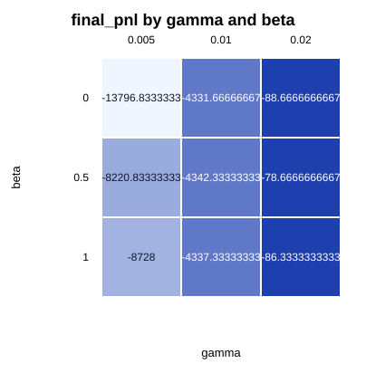
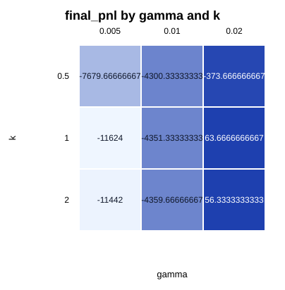

# CMF LOB Backtester Final Report

## 1. Постановка задачи

Цель проекта — воспроизводимый event-driven backtest engine для market-making
стратегий на историческом Market-By-Price order book stream. MVP сравнивает
три подхода:

- fixed-spread baseline;
- Avellaneda-Stoikov strategy;
- microprice-adjusted Avellaneda-Stoikov extension.

Основные критерии: net PnL, drawdown, inventory risk, turnover, fill rate,
spread capture и adverse-selection markout.

## 2. Архитектура Engine

Архитектура описана в [implementation_plan.md](implementation_plan.md) и
[technical_documentation.md](technical_documentation.md). Поток исполнения:

1. `CsvDataSource` стримит `lob.csv` и `trades.csv` в единый ordered event
   stream.
2. `OrderBook` применяет snapshots/updates и поддерживает best bid/ask.
3. `FeatureEngine` считает mid, spread, imbalance, weighted mid и microprice
   proxy.
4. Strategy генерирует `OrderIntent`.
5. `OrderManager` валидирует risk gates и ведёт lifecycle собственных ордеров.
6. `FillModel` исполняет active limit orders по price-cross rule.
7. `Portfolio` и `MetricsEngine` пишут `metrics.json`, `equity_curve.csv`,
   `inventory.csv`, `orders.csv`, `fills.csv`.

Engine не даёт стратегии future state: на каждом event стратегия видит только
уже применённое состояние книги, portfolio и active orders.

## 3. Модели

Fixed-spread baseline выставляет симметричные лимитные заявки:

```text
bid = mid - delta_ticks
ask = mid + delta_ticks
```

Avellaneda-Stoikov использует reservation price и spread:

```text
r_t = mid - q * gamma * sigma^2 * (T - t)
psi_t = gamma * sigma^2 * (T - t) + (2 / gamma) * ln(1 + gamma / k)
bid = r_t - psi_t / 2
ask = r_t + psi_t / 2
```

Microprice extension заменяет fair price:

```text
microprice_proxy = mid + alpha * (spread / 2) * imbalance
fair_price = mid + beta * (microprice_proxy - mid)
r_t = fair_price - q * gamma * sigma^2 * (T - t)
```

`beta = 0` даёт classic A-S, `beta = 1` полностью использует proxy.

## 4. Методология Экспериментов

Использован tracked sample dataset `data/sample`:

- interval: `2024-08-05T06:00:00Z` .. `2024-08-05T07:00:00Z`;
- snapshots: 7,200;
- trades: 750,467;
- total replay events: 757,667.

Базовые прогоны:

- `baseline_fixed`;
- `avellaneda_stoikov`;
- `microprice_as`.

Sensitivity grid: `gamma in {0.005, 0.01, 0.02}`,
`k in {0.5, 1.0, 2.0}`, `beta in {0.0, 0.5, 1.0}`. Это 27
microprice-A-S runs. `beta=0` используется как classic A-S baseline внутри
grid. Walk-forward split не применялся: в репозитории зафиксирован один
часовой sample, а full/raw dataset остаётся untracked local input.

## 5. Результаты

Метрики ниже получены командой `python3 scripts/python/run_experiments.py`.
PnL, drawdown и markout указаны в ticks/notional units engine.

| Strategy | Net PnL | Max DD | Mean inv | Max inv | Turnover qty | Fill rate | Spread captured | Adv 1s | Adv 10s |
| --- | ---: | ---: | ---: | ---: | ---: | ---: | ---: | ---: | ---: |
| Fixed spread | -741593 | 742064 | 0.601 | 10 | 31618 | 0.598724 | 1.001 | -24.153 | -23.945 |
| A-S | -4345 | 48629.5 | 6.078 | 10 | 30 | 0.001700 | 9.617 | -7.117 | -39.063 |
| Microprice A-S | -4345 | 48633.5 | 6.071 | 10 | 28 | 0.001559 | 8.304 | -4.321 | -25.750 |

На базовом конфиге A-S и Microprice-A-S имеют одинаковый net PnL, но
Microprice-A-S получает меньше fills и лучше 1s/10s adverse-selection markout.
Fixed-spread генерирует высокий turnover и fill rate, но проигрывает по PnL и
drawdown.

Лучший grid run: `gamma=0.02, k=1.0, beta=1.0`, net PnL `77`.
Средний net PnL по `beta`:

| beta | Mean grid PnL |
| ---: | ---: |
| 0.0 | -6072.389 |
| 0.5 | -4213.944 |
| 1.0 | -4383.889 |

В среднем по grid microprice-aware runs (`beta > 0`) не хуже classic A-S
proxy (`beta = 0`) по net PnL на этом sample.

## 6. Графики

Dashboard строит overlay equity curves, drawdown, inventory time series,
inventory distributions, fill diagnostics, adverse-selection bars и
sensitivity heatmaps:

```bash
streamlit run scripts/python/dashboard.py -- --reports-dir reports/
```

Static heatmaps из последнего grid сохранены в tracked assets:





Локальные generated artifacts после runner:

- `reports/experiment_summary.md`;
- `reports/_static/sensitivity/final_pnl_gamma_beta.svg`;
- `reports/_static/sensitivity/final_pnl_gamma_k.svg`;
- `reports/grid_gamma_k_beta/*/{metrics.json,equity_curve.csv,inventory.csv,orders.csv,fills.csv}`.

## 7. Обсуждение

Fixed-spread слишком агрессивен для этого sample: он поддерживает высокий
fill rate, но собирает adverse selection и быстро накапливает drawdown.

A-S резко снижает turnover и drawdown за счёт wider quotes и inventory skew.
Цена этого — низкий fill rate и малое число сделок.

Microprice extension полезна как directional fair-price correction. На базовом
конфиге net PnL совпал с A-S, но markout стал лучше. В grid лучший результат
получился при более высоком `gamma=0.02`, `k=1.0`, `beta=1.0`. По среднему PnL
`beta=0.5` оказался устойчивее `beta=1.0`, что похоже на переусиление noisy
top-of-book imbalance при полном proxy.

## 8. Ограничения Модели Исполнения

- Исполнение — price-cross model; реальная queue position не моделируется.
- Partial fills отключены: ордер исполняется целиком или не исполняется.
- Нет submit/cancel latency, exchange acknowledgement delay и jitter.
- Нет market impact: собственные сделки не меняют future book.
- Market-By-Price данные не дают order-level queue reconstruction.
- Fees/rebates поддержаны в конфиге, но основные эксперименты запущены с нулевыми fees.
- Volatility берётся online из rolling mid returns; отдельной калибровки `sigma`
  на train split нет.
- Adverse-selection markout считается на первом доступном event после горизонта
  1s/10s; unresolved fills near end-of-sample не попадают в среднее.

## 9. Roadmap Улучшений

Roadmap взят из
[backtest_engine_plan_avellaneda_stoikov.md §14](backtest_engine_plan_avellaneda_stoikov.md#14-roadmap-улучшений):

1. Partial fills по trade size / available volume.
2. Queue position model поверх Market-By-Price.
3. Submit/cancel latency model.
4. Market impact model для крупных ордеров.
5. Tiered fees/rebates.
6. Multi-level microprice.
7. Learned microprice через transition matrix или ML one-tick-ahead model.
8. Walk-forward optimization.
9. PnL decomposition: spread capture, inventory drift, adverse selection, fees.
10. Performance optimization.

## 10. Воспроизведение

Build and test:

```bash
cmake -S lob_backtester -B build -DCMAKE_BUILD_TYPE=Release
cmake --build build -j
ctest --test-dir build --output-on-failure
```

Run experiments:

```bash
python3 scripts/python/run_experiments.py
```

Run against a local full/raw dataset:

```bash
python3 scripts/python/run_experiments.py --input-path data/raw/MD
```

View results:

```bash
python3 -m venv .venv
source .venv/bin/activate
pip install -r requirements.txt
streamlit run scripts/python/dashboard.py -- --reports-dir reports/
```

Export one static run report:

```bash
python scripts/python/export_static.py --run reports/microprice_as
```
